# 1. 从面试开始

## 1.1. 什么是为服务

## 1.2. 微服务之间是如何独立通讯的 

## 1.3. springCloud和Dubbo有哪些区别？

|          |      dubbo      | springcloud |
| :------: | :-------------: | :---------: |
| 通信机制 | rpc远程过程调用 |    rest     |
|          |                 |             |
|          |                 |             |

## 1.4 SpringBoot和SpringCloud，请你谈谈对他们的理解

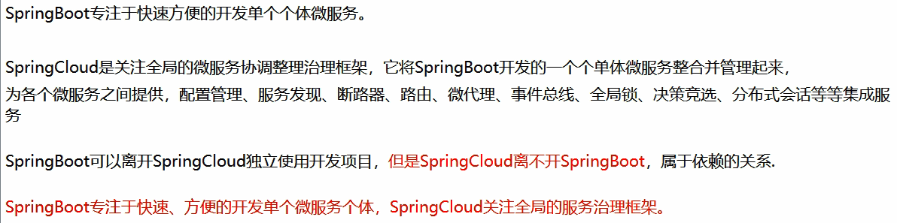

## 1.5 什么是服务熔断？什么是服务降级？

## 1.6 微服务的优缺点分别是什么？说下你在项目开发中碰到的坑

## 1.7 你所知道的微服务技术栈有哪些？请列举一二

## 1.8 eureka和zookeeper都可以提供服务注册和发现功能，请说说两个的区别？

## 2. 微服务概述

## 2.1 是什么

## 2.2 微服务与微服务架构

​	**微服务**：强调的是服务的大小，它关注的是某一个点，是具体解决某一个问题/提供落地对应服务的一个服务应用。狭义的看，可以看作Eclipse里面的一个个微服务工程/或者Module。

​	**微服务架构**: 微服务架构是一种架构模式，它提倡将单一应用程序划分成一组小的服务，服务之间互相协调、互相配合，为用户提供最终价值。每个服务运行在其**独立的进程中**，服务与服务间采用轻量级的通信机制互相协作（通常是基于HTTP协议的RESTful API）。每个服务都围绕着具体业务进行构建，并且能够被独立的部署到生成环境、类生存环境等。另外，**应当尽量避免统一的、集中式的服务管理机制**，对具体的一个服务而言，应根据业务上下文，选择合适的语言、工具对其进行构建。

## 2.3 微服务的优缺点

**优点**：

**缺点**：

1. 开发人员需要处理分布式系统的复杂性；
2. 多服务运维难度；
3. 服务部署依赖；
4. 服务通信成本；
5. 数据一致性； 
6. 系统集成测试；
7. 性能监控

## 2.4 微服务技术栈

| 微服务条目                               | 落地技术                                                     | 备注               |
| ---------------------------------------- | ------------------------------------------------------------ | ------------------ |
| 服务开发                                 | Springboot、spring、springMVC                                |                    |
| 服务配置与管理                           | Netflix公司的Archaius、阿里的Diamon                          |                    |
| 服务注册与发现                           | Eureka、Consul、Zookeeper                                    |                    |
| 服务调用                                 | Rest、RPC、gRPC                                              |                    |
| 服务熔断器                               | Hystrix、Envoy                                               |                    |
| 负载均衡                                 | Ribbon、Nginx                                                |                    |
| 服务接口调用（客户端调用服务的简化工具） | Feign                                                        |                    |
| 消息队列                                 | Kafka、RabbitMQ/aCTIVEmq                                     |                    |
| 服务配置中心管理                         | SpringCloudConfig、Chef                                      |                    |
| 服务路由（API网关）                      | Zuul                                                         |                    |
| 服务监控                                 | Zabbix、Nagios、Metrics、Spectator                           |                    |
| 全链路追踪                               | Zipkin、Brave、Dapper                                        | SpringCloud Sleuth |
| 服务部署                                 | Docker、OpenStack、Kubernetes                                |                    |
| 数据流操作开发包                         | SpringCloud Stream（封装与Redis，Rabbit、Kafka等发送接收消息） |                    |
| 事件消息总线                             | SpringCloud Bus                                              |                    |
|                                          |                                                              |                    |

## 2.5 为什么选择SpringCloud作为微服务架构

​	**选型依据**： 1. 整体解决方案和框架成熟度； 2. 社区热度； 3. 可维护性； 4. 学习曲线

​	**微服务架构有哪些**: 阿里Dubbo/HSF; 京东JSF; 新浪微博Motan

​	

# 3. SpringCloud入门概述

​	**是什么**：springcloud，基于Springboot提供了一套微服务解决方案，是各个微服务架构落地的集合体，包括**服务注册，配置中心，全链路监控，服务网关，负载均衡，断路器**等主键，除了基于NetFlix的开源组件做 高度抽象封装之外，还有一些选型中立的开源组件。

​	SpringCloud利用SpringBoot的开发便利性巧妙地简化了分布式系统基础设施的开发，SpringCloud为开发文员提供了快速构建分布式系统的一些工具，包括**配置管理、服务发现、断路器、路由、微代理、事件总线、全局锁、决策竞选、分布式会话**等等，他们都是可以用SpringBoot的开发风格做到一键启动和部署（**简单易用、易部署和易维护的分布式系统开发工具包**）。

 

# **4**.  Rest微服务构建案例工程模块

# 5. Eureka服务注册与发现

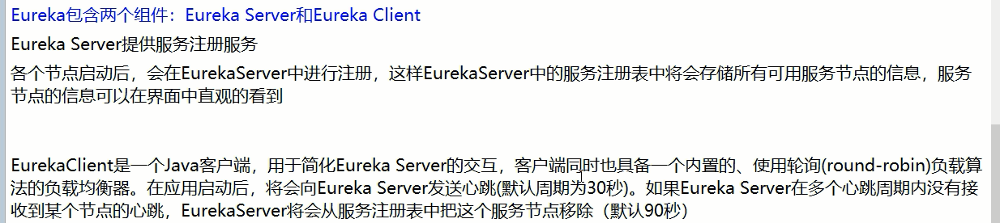

## 	5.1  组件的应用

1. 新增eureka-server（server）/eureka（client）的maven坐标

2. yml文件修改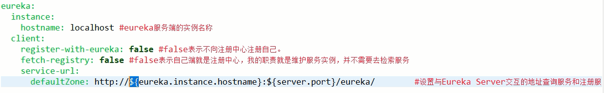

3. 在主启动类上添加`@EnableEurekaServer` `@EnableEurekaClient`

   ## 5.2 actuator

​	**主机名称修改**:  添加`eureka.instance.instance-id: mircroservicecloud-dept8001`

​	**访问信息有IP信息提示**: 添加`eureka.instance.prefer-ip-address: true`

​	**微服务info内容详细信息**:    1. 添加 `spring-boot-start-actuator.jar `；  2. 在pom父工程添加`build`信息；3. 在对应服务yml中添加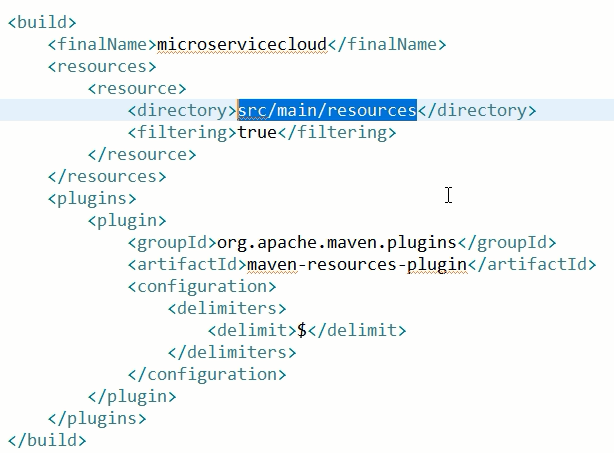 

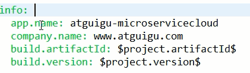

## 	5.3 Eureka自我保护

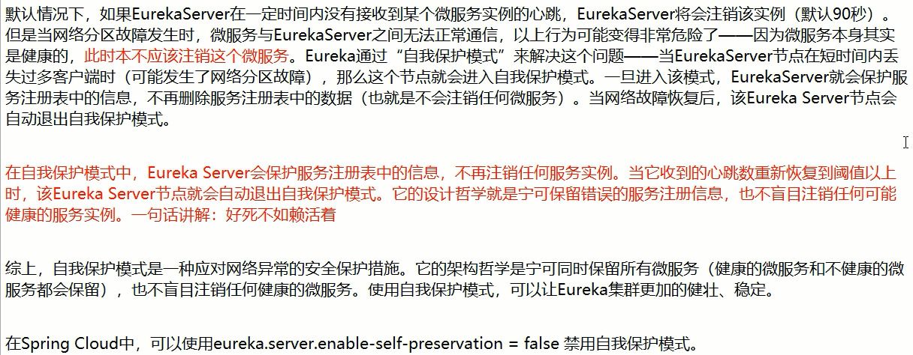

## 	5.4 Eureka的服务发现, 在主启动类上添加`EnableEurekaDiscovery`

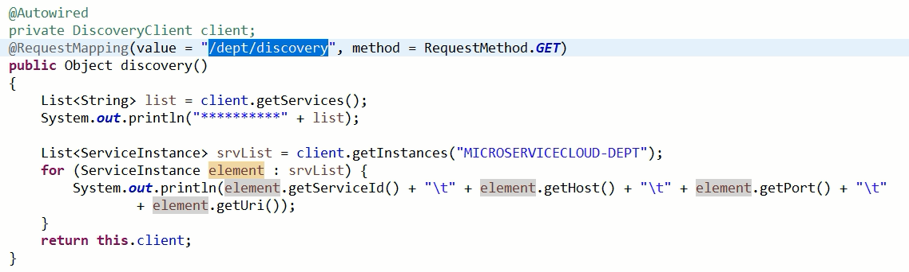

## 	5.5 集群的配置

​	1. server yml的配置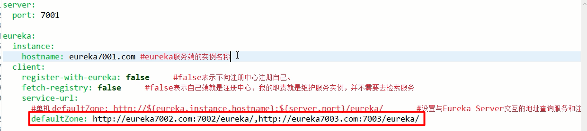

​	2. client yml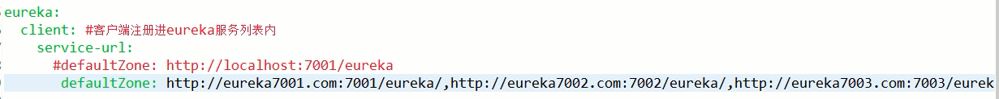

## 	5.6 Eureka与Zookeeper的区别 

** **：Atomicity、Consistency、Isolation、Durability（原子性、一致性、独立性、持久性）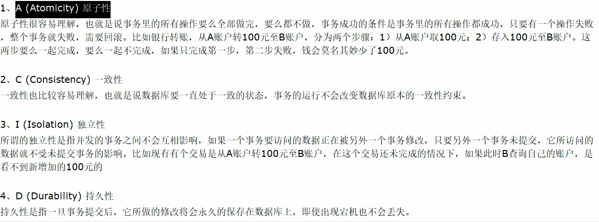

**CAP**：Consistency、Availability、Partition tolerance（强一致性、可用性、分区容错性）

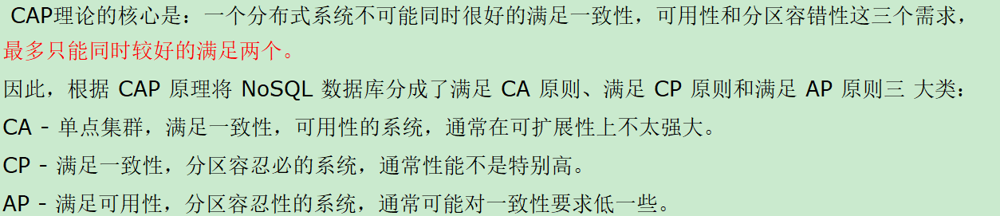

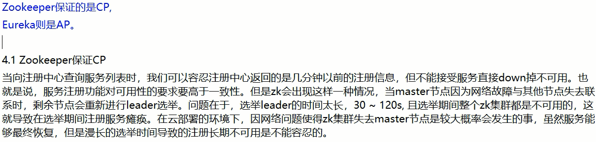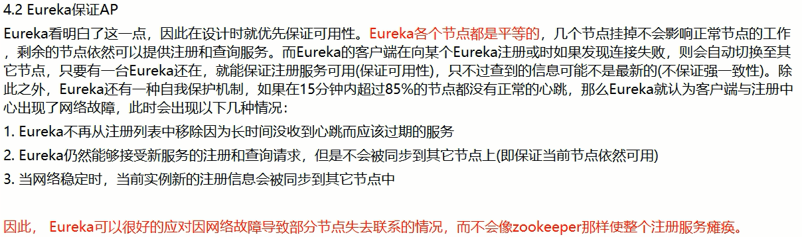

# 6. Ribbon负载均衡

​	SpringCloud Ribbon是基于Netflix Ribbon实现的一套**<u>客户端</u>** **负载均衡(LB)的工具**。 负载均衡简单的说就是将用户的请求平摊的分配到多个服务上，从而达到系统的HA。

​	常见的负载均衡有软件`Nginx`,`LVS`,硬件F5等。相应的在中间件，例如：`dubbo`和`SprinCloud`中均给我们提供了负载均衡，并且**`SpringCloud`的负载均衡算法可以自定义**

​	Ribbon其实就是一个软负载均衡的客户端组件，他**可以和其他所需请求的客户端结合使用，和eureka结合只是其中的一个实例**。	

​	Ribbon在工作时分成两步：1. 选择EurekaServer，它优先选择在同一个区域内负载较少的server； 2. 再根据用户指定的策略，在从server取到的服务注册列表中选择一个地址。其中Ribbon提供了多种策略：比如**轮询、随机和更具响应时间加权**

​	**集中式LB**: 即在**服务的消费方和提供方之间**使用独立的LB设施（可以是硬件，如F5，也可以是软件，如Nginx），由该设施负责把访问请求通过某种策略转发至服务的提供方；

​	**进程内LB**:  将LB逻辑集成到消费方，消费方从服务注册中心获知有哪些地址可用，然后自己再从这些地址中选择一个合适的服务器。**Ribbon就属于进程内LB**，它只是一个类库，**集成于消费方**进程，消费方通过它来获取到服务提供方的地址。

## 6.1 配置初步 (客户端)

1. pom.xml文件中添加（ribbon需要与eureka配对使用 ）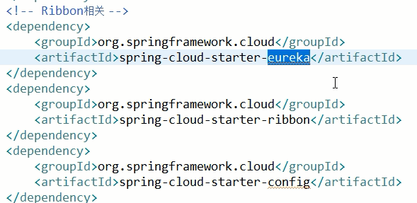

 	2. yml 中添加 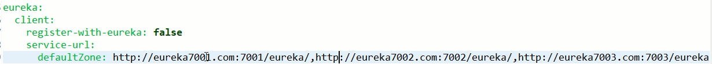
	3. 在RestTemplate 上添加 `@LoadBalanced`
	4. 在主启动类添加`@EnableEurekaClient`
	5. 修改请求url地址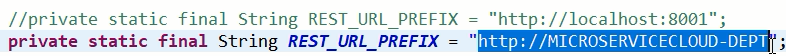

## 6.2 负载均衡测试

​	1. 复制 provider 项目，修改端口、数据库。**保证`spring.application.name`名字一致**

## 6.3 Ribbon核心组件IRule

1. RoundRobinRule

2. RandomRule

3. AvailabilityFilteringRule

4. WeightedResponseTimeRule

5. **RetryRule**： 先按照RoundRobinRule的策略获取服务，如果获取服务失败则在指定时间内会进行重试，获取可用的服务。（如某一服务down机，在访问几次后发现服务不可用，则后续轮询或跳过该服务）

6. BestAvailableRule

7. ZoneAvoidanceRule

   ​

   ## 6.4 负载均衡策略配置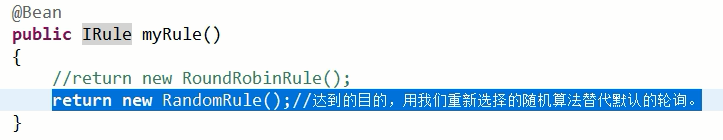

   配置文件定义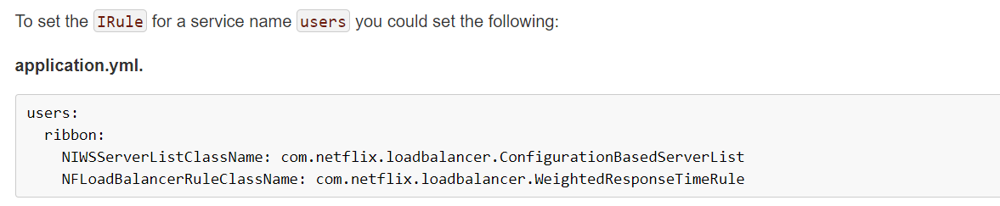

   1. 自定义Ribbon

   2. 注意配置细节

      ​	**[官方文档明确给出了警告](http://cloud.spring.io/spring-cloud-netflix/1.4.x/single/spring-cloud-netflix.html#_customizing_the_ribbon_client)：**

      这个自定义配置类不能放在`@ComponentScan`所扫描的当前包下及及子包下，否则我们自定义的这个配置类就会被所有的Ribbon客户端所共享，也就是不能达到特殊化定制的目的。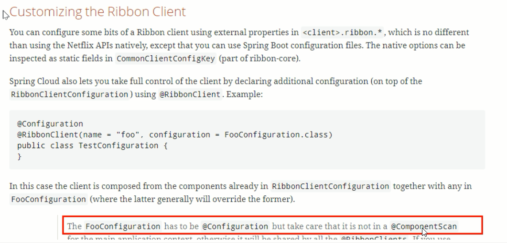

# 7. Feign负载均衡

 	Feign是一个声明式的Web服务客户端，使得编写web服务客户端变得非常容易，**只需要创建一个接口，然后在上面添加注解即可**

​	**Feign能干什么**

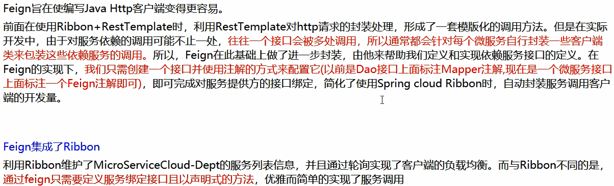

## 7.1 配置初步（客户端+API）

1. 客户端和api层添加`spring-cloud-starter-feign`的依赖
2.  在api层添加接口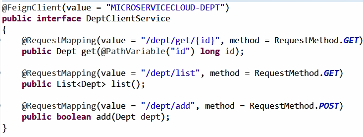
3. 客户端主启动类添加`@EnableFeignClients`

## 7.2 总结

​	**<u>Feign通过接口的方式调用Rest服务（之前是Ribbon+RestTemplate）</u>**

该请求发送给Eureka服务器，(`http://MICROSERVICECLOUD-DEPT/dept/list`),通过Feign直接找到服务接口，由于在进行服务调用的时候融合了Ribbon技术，所以也支持负载均衡作用。

# 8. Hystrix断路器

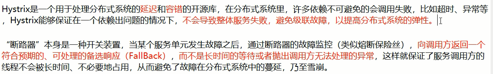

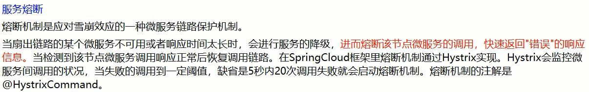

## 8.1 服务熔断（服务端）

​	一般是某个服务故障或者异常引起，类是现实世界中的保险丝，当某个异常条件被触发，直接熔断整个服务，而不是一直等到此服务超时。

1.  单一方法配置
   1. 添加hystix依赖
   2. 主启动类添加`@EnableCircuitBreaker`注解
   3. 在方法上添加注解`@HystrixCommand(fallbackMethod="processHystrix_Get")`

## 8.2 服务降级 （客户端）

​	所谓降级，一般是从整体负荷考虑。就是当某一个服务熔断之后，服务器将不再被调用，此时**客户端可以自己准备一个本地的fallback回调，返回一个缺省值**。这样做，虽然服务水平下降，但好歹可用，比直接挂掉要强。

1. 类配置（**与提供者解耦**），让客户端在服务端不可用时也会获得提示信息而不会挂起耗死服务器
   1. API 添加一个 `XxxClientServiceFallbackFactory implementsFallbackFactory<XxxClientService> `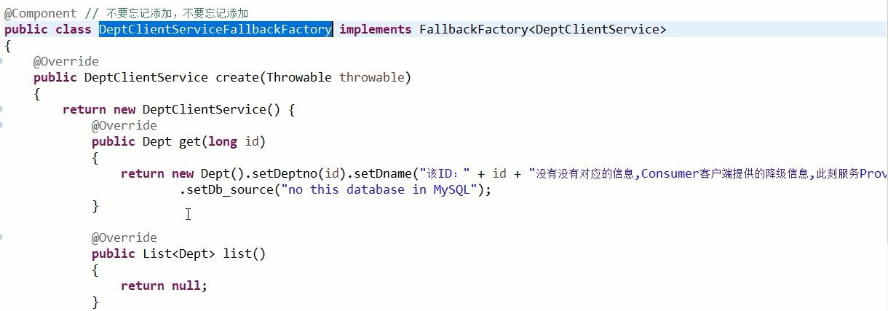
   2. 在api ClientService上添加注解
   3. 客户端添加`feign.hystrix.enabled:true`

## 8.3 服务监控 `hystrixDashboard`

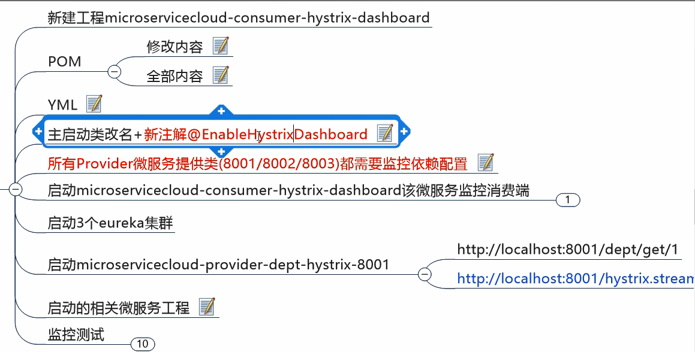

# 9. zuul路由网关

# 10. SpringCloud Config分布式配置中心

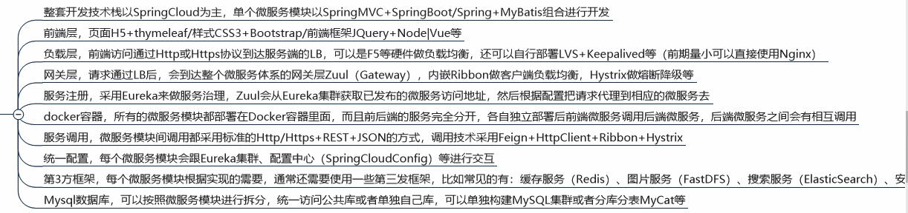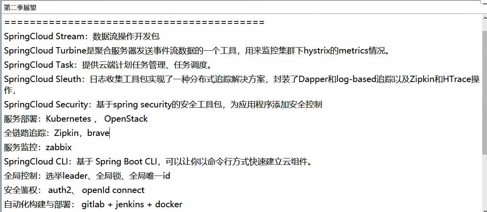
